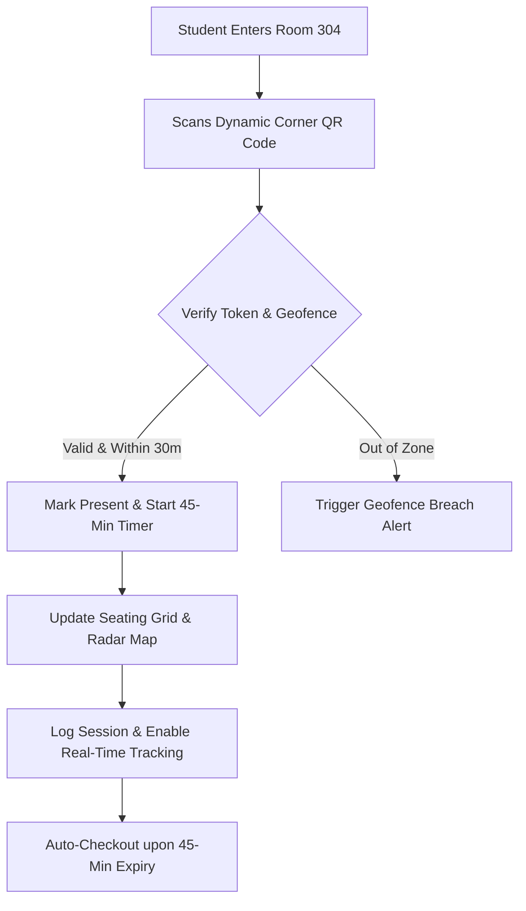

# 🏫 Smart AI Classroom – Live QR Attendance & Geofence Tracker

[](LICENSE)
[](https://developer.mozilla.org/en-US/docs/Web/HTML)
[](https://developer.mozilla.org/en-US/docs/Web/CSS)
[](https://developer.mozilla.org/en-US/docs/Web/JavaScript)
[]()
[]()

An ultra-modern, interactive web platform for **Smart Classroom Attendance & Live Location Tracking**. Featuring dynamic side-corner QR token generation, automatic 45-minute class timer session registration, real-time GPS geofencing with interactive radar map, and an interactive 10-desk seating grid.

---

## 🌟 Key Highlights

- 📱 **Floating Corner QR Engine:** Dynamic, auto-refreshing (30s) QR token generator widget for seamless student check-in with audio feedback.
- ⏱️ **45-Minute Class Timer Manager:** Auto-initiates a strict 45-minute active class countdown per student upon successful QR scanning.
- 🛰️ **Live GPS Geofencing & Radar:** Calculates distance from classroom center via the Haversine formula (30m radius). Triggers real-time alerts if a student leaves the boundary.
- 🪑 **Interactive 10-Desk Seating Grid:** Color-coded real-time status badges (*Present in Zone*, *Geofence Breach*, *Absent*).
- 📊 **Real-time Analytics & CSV Export:** 1-click export of student logs, session timers, and GPS coordinates to CSV.
- 🎨 **Glassmorphism Dark UI:** Built with custom CSS custom properties, smooth animations, and neon glowing indicators.

---

## 🛠️ Architecture Flow



---

## 📁 Project Structure

```
smart-classroom/
├── index.html           # Main Glassmorphic Dashboard & Control Center
├── css/
│   └── styles.css       # Design System (Aurora BG, Glassmorphism, Radar UI)
├── data/
│   └── students.js      # Pre-loaded 10 Student Profiles & Metadata
├── js/
│   ├── app.js           # Main Application State & UI Orchestrator
│   ├── qrcode.js        # Dynamic QR Token Generator & Scanner Engine
│   ├── location.js      # Geolocation API & Haversine Geofence Engine
│   └── timer.js         # 45-Minute Session Timer Manager
└── README.md            # Project Documentation
```

---

## 🚀 Quick Start (Local Setup)

1. **Clone the Repository:**
   ```bash
   git clone https://github.com/yrsubm07/smart-classroom.git
   cd smart-classroom
   ```

2. **Run Locally:**
   Open `index.html` directly in any web browser, or launch a simple local server:
   ```bash
   python -m http.server 8085
   ```
   Navigate to **`http://localhost:8085`**.

---

## 🧪 Built-In Simulator Controls

The dashboard comes with built-in simulation tools to test real-time scenarios:
1. **Simulate QR Scan:** Select any of the 10 students and click **Scan QR** to instantly mark attendance and activate their 45-minute timer.
2. **Simulate Geofence Breach:** Select a present student and click **Breach Geofence** to simulate them walking outside the 30-meter radius. Watch the seating grid and radar map turn amber with real-time alert logs!

---

## 👨‍💻 Tech Stack

- **Frontend:** HTML5, Modern Vanilla CSS3, JavaScript (ES6+ Modules)
- **Design System:** Glassmorphism, Modern CSS Grid & Flexbox, Google Fonts (*Plus Jakarta Sans*, *Outfit*)
- **Icons:** Boxicons CDN
- **QR Engine:** QRServer API + Dynamic Hash Hashing
- **Location Engine:** HTML5 Geolocation API & Haversine Distance Formula

---

## 📄 License

This project is licensed under the **MIT License** - see the [LICENSE](LICENSE) file for details.

*Crafted with ❤️ for Smart Education Systems.*
